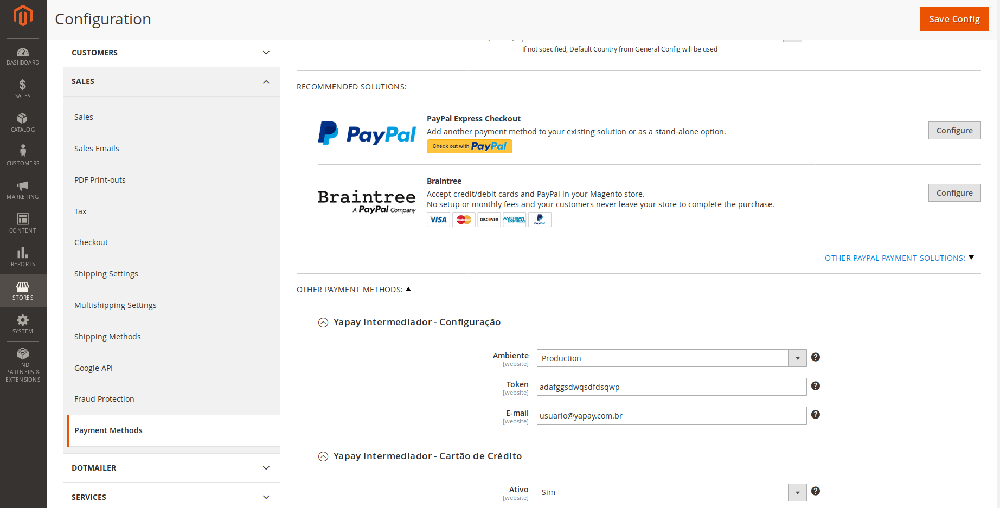
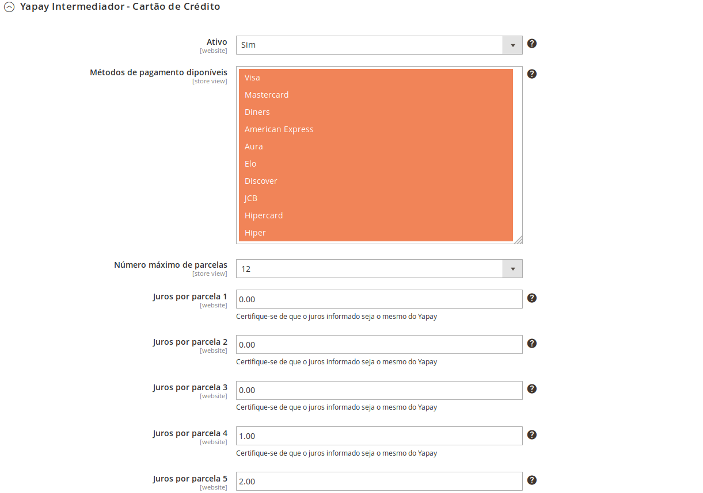
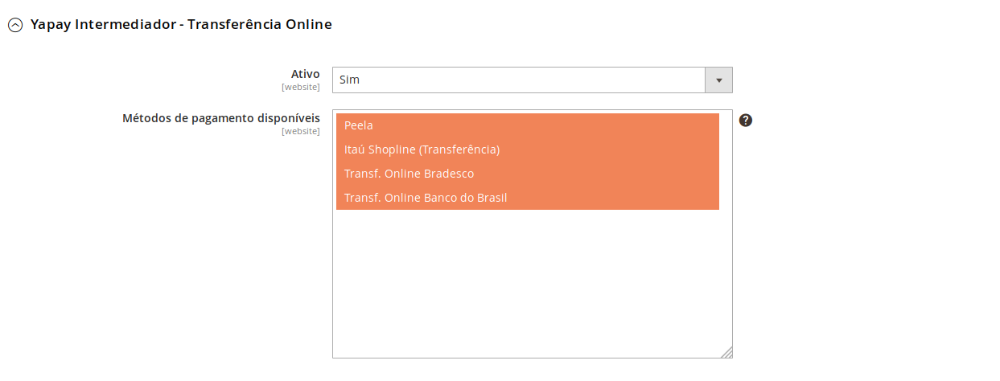

# Magento Extension for [Yapay Intermediador de Pagamentos](https://www.yapay.com.br/) 

## Instalação

### Versões Compativeis:

- [x] 2.0.x
- [x] 2.1.x
- [x] 2.2.x

### Instalação do Módulo Yapay:

- Realize o download do módulo e siga os seguintes passos de acordo com a forma que sua loja foi instalada:

#### [Yapay-Magento 2](https://github.com/YapayPagamentos/yapay-magento2.git)


### Instalar usando o Composer
-  Se sua loja foi criada usando o gerenciador de dependência composer, realize os seguintes passos:

1. Crie o diretório ```code``` dentro diretório ```app```
2. Extraia o conteúdo do download ZIP e mova o diretório ```\magento2\``` para dentro da pasta ```code```
3. Verifique se a disposição dos diretórios de sua loja está: ```_app/code/Yapay/Magento2_```
4. Execute o comando ```_bin/magento setup:upgrade_```
5. Execute o comando ```_bin/magento setup:di:compile_```
6. Execute o comando ```_bin/magento setup:static-content:deploy -f_```


### Instalar usando o github
- Caso sua loja tenha sido criada por meio do clone ou download do projeto magento, siga os seguintes passos:

1. Extraia o conteúdo do download ZIP e mova o diretório ```\magento2\``` para dentro da pasta ```code```
2. Verifique se está dessa maneira seus diretórios na sua loja ```_app/code/Yapay/Magento2_```
3. Execute o comando ```_bin/magento setup:upgrade_```
4. Execute o comando ```_bin/magento setup:di:compile_```
5. Execute o comando ```_bin/magento setup:static-content:deploy -f_```


## Configuração

### Configuração

Acesse no Painel Administrativo do Magento No menu lateral clique em  {+ Store +} na sequencia no sub-menu {+ Sales +} clique em {+ Payment Methods +}. Será carregada a tela para configurar os meios de pagamentos do site. 




### Como habilitar a Yapay no seu site

No primeiro bloco de informação, estão as informações de configuração da sua conta Yapay. 

- Ambiente
	- [x] Seleciona qual versão de ambiente da Yapay que o site estará apontando. Os ambientes disponíveis são: ```Sandbox``` e ```Produção```.
	
- Token
	- [x] Chave de integração da conta Yapay. Os tokens de produção e sandbox são distintos.
	- [x] O token da conta é gerado após cadsatro da conta

- E-mail
	- [x] E-mail utilizado para criação da conta Yapay. 	

	


### Configurando os meios de pagamentos

#### Cartão de Crédito

- Ativo

- Métodos de pagamento disponíveis

- Número máximo de parcelas



#### Transferência Online

- Ativo

- Métodos de pagamento disponíveis



#### Boleto Bancário

- Ativo

- Métodos de pagamento disponíveis


